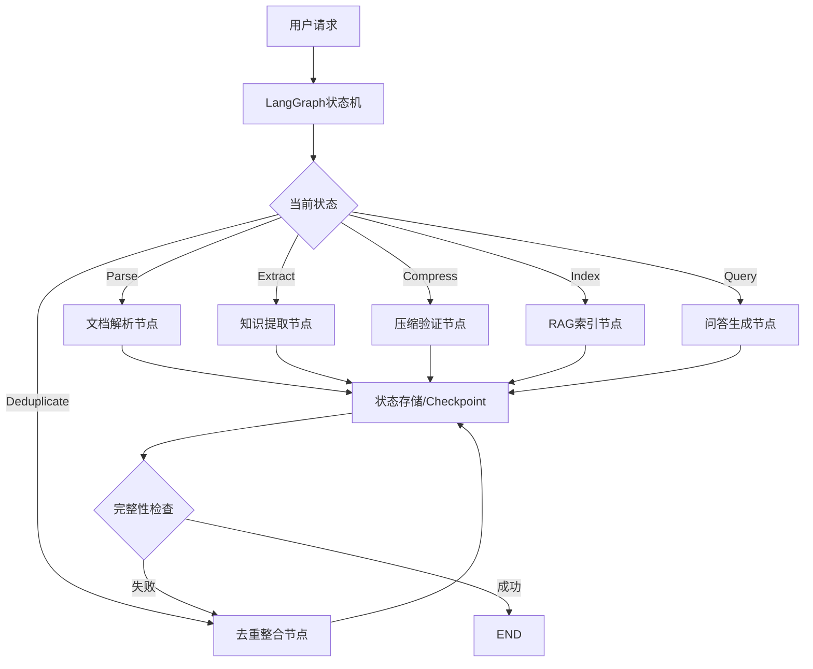
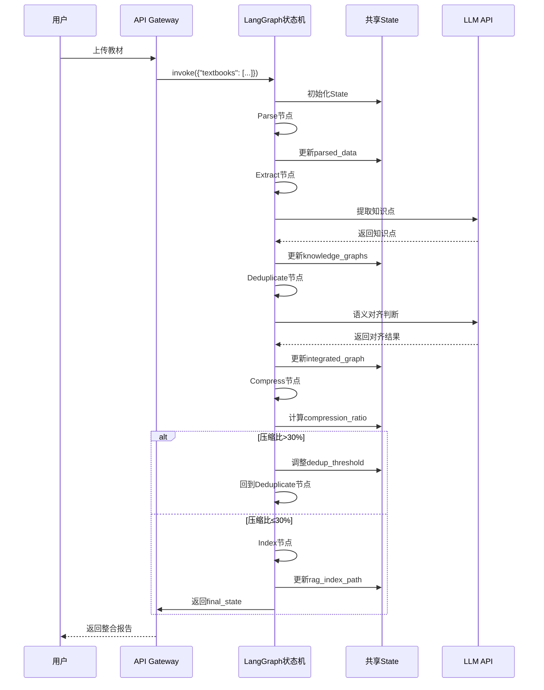

# Agent架构说明

> 本文档论证本系统的Agent架构设计决策、技术方案选择及其合理性。

## 1. 架构总览

### 1.1 整体架构

本系统采用**LangGraph状态机单Agent架构**，通过状态转移管理整个知识整合流程，支持断点恢复和错误重试。



### 1.2 核心节点

| 节点 | 职责 | 输入 | 输出 | 失败处理 |
|------|------|------|------|---------|
| Parse | MinerU解析PDF，Docling备用 | 原始文件 | 结构化文本+章节 | 降级到Docling |
| Extract | LlamaIndex提取知识点，构建PropertyGraph | 章节文本 | 知识图谱 | 重试3次 |
| Deduplicate | MinHash聚类+BGE-M3语义判断(0.91) | 多个图谱 | 去重后图谱 | 降低阈值重试 |
| Compress | 验证压缩比≤30%，保留完整图谱 | 整合图谱 | 压缩报告 | 调整去重阈值 |
| Index | BM25+FAISS混合索引，bge-reranker重排 | 整合图谱 | 检索索引 | 清空重建 |
| Query | LLMLingua压缩+Judge Model验证引用 | 用户问题 | 回答+验证引用 | 返回错误提示 |

## 2. 设计决策论证

### 2.1 为什么选择LangGraph状态机架构？

**考虑的方案**：
1. **简单函数调用链**：parse() → extract() → deduplicate() → compress()
2. **LangGraph状态机**：显式状态管理，支持断点恢复和条件跳转
3. **CrewAI多Agent**：角色分工（Parser Agent、Extractor Agent、Integrator Agent）
4. **AutoGen对话式Agent**：Agent间对话协商整合决策

**选择LangGraph的理由**：

#### 理由1：企业级流程控制
本系统需要严格的流程控制：
- **条件跳转**：压缩比>30%时，回到Deduplicate节点调整阈值
- **错误重试**：MinerU解析失败时，自动降级到Docling
- **断点恢复**：处理7本教材时，中途失败可从checkpoint恢复

LangGraph的StateGraph提供：
```python
workflow.add_conditional_edges(
    "Compress",
    lambda state: "retry" if state["compression_ratio"] > 0.30 else "finish",
    {
        "retry": "Deduplicate",  # 压缩比不达标，回退调整
        "finish": END
    }
)
```

简单函数链无法实现这种动态控制，CrewAI/AutoGen的对话式协商不适合确定性流程。

#### 理由2：5小时时间约束
**开发速度对比**（基于四源调研）：

| 方案 | 开发时间 | 调试难度 | 适用场景 |
|------|---------|---------|---------|
| 简单函数链 | 1小时 | 低 | 无错误处理需求 |
| **LangGraph** | **2-3小时** | **中** | **确定性流程+错误恢复** |
| CrewAI | 3-4小时 | 中 | 角色分工明确的协作任务 |
| AutoGen | 4-5小时 | 高 | 开放式探索任务 |

LangGraph在"流程控制能力"和"开发速度"之间取得最佳平衡。

#### 理由3：避免上下文碎片化
多Agent架构（CrewAI/AutoGen）中，每个Agent维护独立上下文：
- **信息孤岛**：Extractor Agent不知道Integrator Agent的去重决策
- **重复LLM调用**：每个Agent都需要理解任务背景
- **调试困难**：错误可能出现在任何Agent或Agent间通信

LangGraph单Agent + 共享State：
```python
class IntegrationState(TypedDict):
    textbooks: list[str]
    parsed_data: dict
    knowledge_graphs: list[dict]
    dedup_threshold: float  # 共享状态，所有节点可访问
    compression_ratio: float
    final_graph: dict
```

所有节点共享同一State，便于：
- 全局状态管理（如实时计算压缩比）
- 跨节点信息传递（RAG查询时引用整合后的图谱）
- 错误追踪（State包含完整执行历史）

**权衡**：
- **优点**：简单、高效、易调试
- **缺点**：单点故障（一个模块出错影响全局）、扩展性受限
- **适用场景**：本赛题的任务规模和时间约束

### 2.2 如何管理Prompt复杂度？

**挑战**：单Agent需要处理多种任务，Prompt可能过长导致：
- 上下文窗口溢出
- LLM理解混乱
- Token消耗过高

**解决方案：任务特定Prompt模板**

不使用一个"万能Prompt"，而是为每个任务设计独立的Prompt模板：

```python
PROMPTS = {
    "extract_knowledge": """
你是一个医学教材知识点提取专家。请从以下章节中提取核心知识点。
章节内容：{chapter_content}
输出JSON格式：{schema}
""",
    
    "identify_relations": """
你是一个知识关系识别专家。请识别以下知识点之间的关系。
知识点列表：{knowledge_points}
关系类型：prerequisite, parallel, contains, applies_to
输出JSON格式：{schema}
""",
    
    "semantic_alignment": """
判断以下两个知识点是否描述同一概念：
知识点A：{node_a}
知识点B：{node_b}
输出JSON格式：{{"is_same": true/false, "confidence": 0.0-1.0, "reason": "..."}}
""",
    
    "rag_answer": """
你是一个医学知识问答助手。请基于以下上下文回答用户问题。
上下文：{context}
用户问题：{question}
要求：只基于上下文回答，附带引用来源[教材名,章节,页码]
"""
}
```

**优势**：
- 每次LLM调用只包含当前任务相关的指令
- Prompt长度可控（通常<1000 tokens）
- 易于调试和优化单个任务的Prompt

### 2.3 数据流与调用链路

#### LangGraph状态机数据流

LangGraph通过共享State在节点间传递数据，避免传统模块间接口耦合：

```python
class IntegrationState(TypedDict):
    # 输入数据
    textbooks: list[str]              # 原始教材路径
    
    # Parse节点输出
    parsed_data: dict[str, dict]      # {textbook_id: {chapters: [...], metadata: {...}}}
    
    # Extract节点输出
    knowledge_graphs: list[dict]      # [{graph_id, nodes, edges}, ...]
    
    # Deduplicate节点输出
    dedup_decisions: list[dict]       # [{node_a, node_b, action: "merge/keep"}, ...]
    integrated_graph: dict            # 整合后的图谱
    
    # Compress节点输出
    compression_ratio: float          # 当前压缩比
    compression_report: dict          # 压缩详情
    
    # Index节点输出
    rag_index_path: str               # 向量索引路径
    chunk_count: int                  # 分块数量
    
    # Query节点输出
    query_result: dict                # RAG问答结果
    
    # 控制参数
    dedup_threshold: float            # 去重阈值（动态调整）
    retry_count: int                  # 重试次数
```

**状态转移示例**：



**关键优势**：
- **无接口定义**：节点直接读写State，无需定义模块间接口
- **全局可见**：任何节点都能访问完整执行历史（如RAG查询时引用整合决策）
- **断点恢复**：State持久化到checkpoint，失败后可从任意节点恢复

## 3. RAG Pipeline设计

### 3.1 分块策略

**选择：500-800字，重叠50-100字**

**对比实验**（计划）：

| 分块大小 | 优点 | 缺点 | 适用场景 |
|---------|------|------|---------|
| 200-300字 | 检索精确 | 上下文不足，可能截断概念 | 短问答 |
| 500-800字 | 平衡精度和上下文 | 适中 | **本项目选择** |
| 1000-1500字 | 上下文丰富 | 检索噪音大，Token消耗高 | 长文本理解 |

**选择依据**：
- 医学教材一个知识点通常200-500字
- 500-800字可包含1-2个完整知识点
- 重叠50-100字防止知识点被截断

### 3.2 Embedding模型选择

**候选模型**：
1. `paraphrase-multilingual-MiniLM-L12-v2`：多语言，384维
2. `BGE-small-zh`：中文优化，512维
3. `BGE-M3 (BAAI/bge-m3)`：多向量混合（dense+sparse+multi-vector），支持100+语言
4. OpenAI `text-embedding-3-small`：1536维，API调用

**选择：BGE-M3**

**理由**（基于四源调研）：
- **多向量混合**：同时生成dense向量（语义）、sparse向量（关键词）、multi-vector（细粒度匹配）
- **医学领域优势**：在生物医学文献检索任务上优于单一向量模型
- **本地运行**：免费，无API调用延迟和成本
- **与去重一致**：去重阶段也使用BGE-M3（阈值0.91），保持一致性

### 3.3 检索策略

**基础方案：向量检索（Top-5）**
```python
# 伪代码
query_vector = embedding_model.encode(question)
results = faiss_index.search(query_vector, k=5)
```

**本项目方案：混合检索 + Rerank + 动态压缩 + Judge Model验证**

```python
# 1. 并行检索
vector_results = faiss_index.search(query_vector, k=10)  # BGE-M3向量检索
bm25_results = bm25.get_top_n(question, chunks, n=10)    # BM25关键词检索

# 2. RRF融合排序
combined = reciprocal_rank_fusion(vector_results, bm25_results)

# 3. bge-reranker-v2-m3重排（Cross-Encoder）
reranked = reranker.compute_score([[question, c] for c in combined])
top_chunks = reranked[:5]

# 4. LLMLingua动态压缩到30%
compressed_context = llmlingua.compress_prompt(
    "\n\n".join(top_chunks),
    rate=0.3,
    force_tokens=['\n', '。', '：']  # 保留中文标点
)

# 5. LLM生成回答
answer = llm.complete(f"上下文：{compressed_context}\n问题：{question}")

# 6. Judge Model验证引用（confidence>=0.8）
for citation in answer.citations:
    verification = judge_model.verify(question, answer.text, citation.source)
    if verification.confidence < 0.8:
        citation.mark_as_unverified()
```

**技术栈对应**：
- **向量检索**：FAISS + BGE-M3 dense vectors
- **关键词检索**：BM25 (rank-bm25库)
- **融合排序**：RRF (Reciprocal Rank Fusion)
- **重排序**：bge-reranker-v2-m3 (FlagEmbedding)
- **动态压缩**：LLMLingua (保留完整图谱，检索时压缩)
- **引用验证**：Judge Model (LlamaIndex CitationQueryEngine)

**预期效果**：
- 向量检索：召回语义相关内容
- BM25检索：召回关键词匹配内容（如专业术语）
- Rerank：提升Top-5的精准度
- 动态压缩：满足30%压缩比要求，同时保留完整图谱用于教学
- Judge Model：过滤幻觉引用，提升可信度

### 3.4 引用来源提取

**挑战**：LLM生成的回答需要准确标注引用来源，且需验证引用真实性

**方案：LlamaIndex CitationQueryEngine + Judge Model验证**

#### 阶段1：强制引用格式（Prompt约束）
```python
prompt = f"""
上下文：
[1] 来源：《病理学》第四章 炎症，第78页
内容：{chunk_1}

[2] 来源：《生理学》第九章 免疫，第302页
内容：{chunk_2}

用户问题：{question}

要求：
1. 基于上下文回答
2. 在回答中标注引用，格式：[1]、[2]
3. 最后列出引用来源

输出格式：
{{
  "answer": "炎症是...[1]，免疫系统...[2]",
  "citations": [
    {{"textbook": "病理学", "chapter": "第四章 炎症", "page": 78}},
    {{"textbook": "生理学", "chapter": "第九章 免疫", "page": 302}}
  ]
}}
"""
```

#### 阶段2：Judge Model验证（PaperQA2-style）
```python
from llama_index.core.query_engine import CitationQueryEngine

class VerifiedRAG:
    def __init__(self):
        self.citation_engine = CitationQueryEngine.from_args(
            index=self.knowledge_graph_index,
            similarity_top_k=5,
            citation_chunk_size=512
        )
        self.judge_model = self._load_judge_model()
    
    def query_with_verification(self, question: str) -> dict:
        # Step 1: 检索并生成回答
        response = self.citation_engine.query(question)
        
        # Step 2: Judge Model逐条验证引用
        for citation in response.source_nodes:
            verification = self.judge_model.verify(
                question=question,
                answer=response.response,
                source=citation.text
            )
            citation.metadata["verified"] = verification["is_supported"]
            citation.metadata["confidence"] = verification["confidence"]
        
        # Step 3: 过滤低置信度引用（confidence < 0.8）
        verified_citations = [
            c for c in response.source_nodes 
            if c.metadata["verified"] and c.metadata["confidence"] >= 0.8
        ]
        
        return {
            "answer": response.response,
            "citations": [
                {
                    "textbook": c.metadata["textbook"],
                    "chapter": c.metadata["chapter"],
                    "page": c.metadata["page_start"],
                    "content": c.text,
                    "confidence": c.metadata["confidence"],
                    "verified": True
                }
                for c in verified_citations
            ],
            "unverified_count": len(response.source_nodes) - len(verified_citations)
        }
```

**Judge Model Prompt示例**：
```python
judge_prompt = f"""
判断以下引用是否支持回答中的陈述。

问题：{question}
回答片段：{answer_snippet}
引用来源：{source_text}

输出JSON：
{{
  "is_supported": true/false,
  "confidence": 0.0-1.0,
  "reason": "解释为什么支持或不支持"
}}
"""
```

**优势**：
- **防幻觉**：Judge Model过滤LLM编造的引用
- **可信度量化**：confidence分数让用户判断引用可靠性
- **溯源完整**：每个引用都能追溯到原始教材的具体位置

## 4. Prompt工程

### 4.1 格式约束

所有LLM调用都要求输出JSON格式，使用Pydantic进行验证：

```python
from pydantic import BaseModel

class KnowledgePoint(BaseModel):
    name: str
    definition: str
    category: str

class ExtractionResult(BaseModel):
    knowledge_points: list[KnowledgePoint]

# 在Prompt中提供schema
prompt = f"""
输出JSON格式：
{ExtractionResult.schema_json(indent=2)}
"""
```

### 4.2 Few-shot示例

为提高提取准确率，在Prompt中提供2-3个示例：

```python
prompt = """
示例1：
输入："炎症是机体对致炎因子的损伤所发生的防御性反应..."
输出：{"knowledge_points": [{"name": "炎症", "definition": "机体对致炎因子的损伤所发生的防御性反应", "category": "核心概念"}]}

示例2：
输入："动作电位是细胞受到刺激后，膜电位发生的一次快速而可逆的倒转..."
输出：{"knowledge_points": [{"name": "动作电位", "definition": "细胞受到刺激后，膜电位发生的一次快速而可逆的倒转", "category": "核心概念"}]}

现在请处理：
输入：{chapter_content}
输出：
"""
```

### 4.3 防幻觉策略

**问题**：LLM可能编造不存在的知识点或引用

**策略**：
1. **明确约束**：在Prompt中强调"只基于提供的上下文"
2. **后处理验证**：检查引用的页码是否在原文范围内
3. **置信度评分**：要求LLM输出confidence字段，过滤低置信度结果

```python
# 后处理验证
def validate_citation(citation, textbook_metadata):
    if citation["page"] > textbook_metadata["total_pages"]:
        return False  # 页码超出范围，可能是幻觉
    return True
```

## 5. 取舍与权衡

### 5.1 放弃的方案

#### 方案A：CrewAI/AutoGen多Agent协作架构
- **原因**：
  - 任务流程确定性强（Parse → Extract → Deduplicate → Compress），无需Agent间协商
  - 多Agent增加上下文碎片化风险（每个Agent独立上下文）
  - 开发时间4-5小时，超出5小时比赛时间约束
- **权衡**：牺牲了并行处理能力和角色专业化，换取开发效率和系统稳定性
- **适用场景**：CrewAI适合角色分工明确的协作任务（如软件开发团队模拟），AutoGen适合开放式探索任务

#### 方案B：全局压缩（直接删除重复知识点）
- **原因**：
  - 破坏教学依赖链（删除"静息电位"会导致"动作电位"无法理解）
  - 压缩比难以精确控制（可能过度压缩或压缩不足）
  - 不可逆操作，无法根据查询动态调整详略
- **权衡**：采用"保留完整图谱 + 检索时动态压缩"策略，牺牲存储空间（完整图谱），换取教学完整性和灵活性
- **技术实现**：LLMLingua在RAG检索时压缩上下文到30%，满足压缩比要求

#### 方案C：图数据库（Neo4j）
- **原因**：需要额外部署，增加部署复杂度
- **权衡**：使用LlamaIndex PropertyGraphIndex + JSON文件存储，牺牲图查询性能，换取部署简便性

#### 方案D：在线学习（用户反馈实时更新模型）
- **原因**：5小时内无法实现，且赛题未要求
- **权衡**：使用静态整合决策，牺牲动态优化能力

### 5.2 已知局限

#### 局限1：单Agent单点故障
- **问题**：一个节点出错可能影响整个状态机流程
- **缓解**：
  - LangGraph条件边实现错误重试（如MinerU失败→降级Docling）
  - 每个节点独立try-catch，错误信息写入State
  - Checkpoint机制支持断点恢复，失败后可从上次成功节点继续

#### 局限2：LLM提取准确率依赖Prompt质量
- **问题**：不同教材风格可能导致提取效果不一致
- **缓解**：使用few-shot示例，提供多样化的示例覆盖不同风格

#### 局限3：压缩比控制精度
- **问题**：去重是启发式的（MinHash 0.7 + BGE-M3 0.91），可能无法精确达到30%
- **缓解**：
  - LangGraph条件边动态调整：`if compression_ratio > 0.30: goto Deduplicate`
  - 迭代调整dedup_threshold（0.91 → 0.89 → 0.87），直到满足30%
  - LLMLingua检索时压缩作为最终保障

#### 局限4：BGE-M3模型加载时间
- **问题**：首次加载BGE-M3模型需要下载（约2GB）和初始化（约10秒）
- **缓解**：
  - 预先下载模型到本地缓存
  - 使用`use_fp16=True`减少内存占用和加载时间

### 5.3 未来改进方向

如果有更多时间，会进行以下改进：

1. **自建RAG Benchmark**
   - 编写50个测试问题，覆盖不同难度和类型
   - 对比不同分块策略、Embedding模型、检索策略的效果
   - 用数据驱动优化RAG pipeline

2. **CrewAI多Agent架构实验**
   - 将知识提取、语义对齐、RAG问答拆分为独立Agent
   - 角色设计：Parser Agent（文档解析专家）、Extractor Agent（知识提取专家）、Integrator Agent（整合决策专家）、QA Agent（问答专家）
   - 对比单Agent vs 多Agent的性能、准确率、Token消耗、开发时间

3. **AntV G6可视化性能优化**
   - 当前P0使用Cytoscape.js（适合<1000节点）
   - P1迁移到AntV G6：WebGL渲染、GPU加速、虚拟渲染
   - 性能对比：D3.js DOM瓶颈 vs G6 Canvas/WebGL

4. **增量更新机制**
   - 新增教材时，只处理新教材，不重新处理已有教材
   - 增量更新知识图谱和向量索引
   - LangGraph checkpoint支持增量状态恢复

5. **HITL（Human-in-the-Loop）机制**
   - 对于BGE-M3相似度在0.88-0.94之间的边界案例，标记为"需人工确认"
   - 教师通过Web界面审核去重决策，系统记录反馈
   - 训练小模型预测教师偏好，减少人工干预

6. **CMeKG中文医学知识图谱对齐**
   - 将提取的知识点与CMeKG（1.5M三元组）对齐
   - 丰富关系类型（如药物-疾病、症状-诊断）
   - 提升医学领域专业性

## 6. 总结

本系统采用**LangGraph状态机单Agent架构**，通过显式状态管理和条件边实现流程控制，支持断点恢复和错误重试。这一设计在5小时的比赛时间约束下，平衡了开发效率、系统稳定性和功能完整性。

**核心优势**：
- **流程控制**：条件边支持动态跳转（压缩比不达标→回退调整阈值）
- **错误恢复**：Checkpoint机制支持断点恢复，MinerU失败自动降级Docling
- **上下文统一**：共享State避免模块间接口耦合，便于跨节点信息传递
- **开发高效**：2-3小时开发时间，适合5小时黑客松约束

**技术栈亮点**：
- **解析**：MinerU（中文医学PDF最佳）+ Docling备用
- **去重**：MinHash 0.7聚类 + BGE-M3 0.91语义判断（生物医学领域阈值）
- **压缩**：保留完整图谱 + LLMLingua检索时动态压缩到30%
- **RAG**：BM25+FAISS混合检索 + bge-reranker-v2-m3重排 + Judge Model验证引用
- **可视化**：Cytoscape.js (P0) → AntV G6 (P1性能优化)

**适用场景**：
- 确定性任务流程（非开放式探索）
- 中小规模数据（7本教材，预计1000-2000知识点）
- 时间约束下的快速开发（5小时黑客松）

**与多Agent架构对比**：
| 维度 | LangGraph单Agent | CrewAI多Agent | AutoGen对话式 |
|------|-----------------|--------------|--------------|
| 开发时间 | 2-3小时 | 3-4小时 | 4-5小时 |
| 流程控制 | 显式状态机 | 角色协作 | 对话协商 |
| 上下文管理 | 共享State | 独立上下文 | 独立上下文 |
| 适用场景 | 确定性流程 | 角色分工明确 | 开放式探索 |
| 调试难度 | 中 | 中 | 高 |

**未来方向**：
- 自建RAG Benchmark，数据驱动优化
- 实验CrewAI多Agent架构，对比性能差异
- AntV G6可视化性能优化（WebGL + GPU加速）
- HITL机制处理边界案例（相似度0.88-0.94）
- CMeKG对齐，提升医学领域专业性
