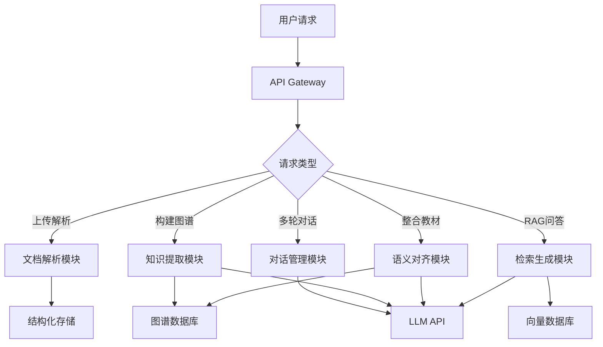
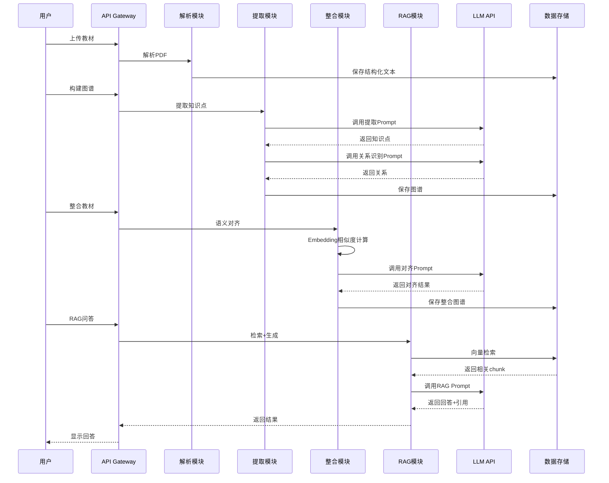

# Agent架构说明

> 本文档论证本系统的Agent架构设计决策、技术方案选择及其合理性。

## 1. 架构总览

### 1.1 整体架构

本系统采用**模块化单Agent架构**，通过功能模块划分实现职责分离，同时保持统一的控制流程。



### 1.2 核心模块

| 模块 | 职责 | 输入 | 输出 |
|------|------|------|------|
| 文档解析模块 | PDF/DOCX/MD/TXT解析，章节识别 | 原始文件 | 结构化文本 |
| 知识提取模块 | LLM提取知识点，识别关系 | 章节文本 | 知识图谱 |
| 语义对齐模块 | 跨教材知识点去重，整合决策 | 多个图谱 | 整合图谱 |
| 检索生成模块 | RAG问答，引用来源 | 用户问题 | 回答+引用 |
| 对话管理模块 | 多轮对话，修改整合决策 | 对话历史 | 更新决策 |

## 2. 设计决策论证

### 2.1 为什么选择单Agent架构？

**考虑的方案**：
1. **单Agent方案**：所有功能由一个统一的Agent协调完成
2. **多Agent方案**：每个功能模块独立为一个Agent，通过消息传递协作

**选择单Agent的理由**：

#### 理由1：任务流程线性，无需并行协作
本系统的核心流程是线性的：
```
上传 → 解析 → 提取 → 整合 → 问答
```
每个步骤依赖前一步的输出，不存在多个Agent需要并行工作的场景。多Agent的协调开销（消息传递、状态同步）反而会降低效率。

#### 理由2：避免上下文碎片化
多Agent架构中，每个Agent维护独立的上下文，导致：
- **信息孤岛**：知识提取Agent不知道整合Agent的决策
- **重复调用LLM**：每个Agent都需要单独理解用户意图
- **调试困难**：问题可能出现在任何Agent或Agent间通信

单Agent架构下，所有模块共享同一上下文，便于：
- 全局状态管理（如压缩比实时计算）
- 跨模块信息传递（如RAG问答时引用整合后的图谱）
- 错误追踪和调试

#### 理由3：降低系统复杂度
多Agent架构需要额外设计：
- Agent间通信协议
- 任务分发与调度机制
- 冲突解决策略（如两个Agent对同一知识点做出不同决策）

在5小时的比赛时间内，单Agent架构能更快实现和调试。

**权衡**：
- **优点**：简单、高效、易调试
- **缺点**：单点故障（一个模块出错影响全局）、扩展性受限
- **适用场景**：本赛题的任务规模和时间约束

### 2.2 如何管理Prompt复杂度？

**挑战**：单Agent需要处理多种任务，Prompt可能过长导致：
- 上下文窗口溢出
- LLM理解混乱
- Token消耗过高

**解决方案：任务特定Prompt模板**

不使用一个"万能Prompt"，而是为每个任务设计独立的Prompt模板：

```python
PROMPTS = {
    "extract_knowledge": """
你是一个医学教材知识点提取专家。请从以下章节中提取核心知识点。
章节内容：{chapter_content}
输出JSON格式：{schema}
""",
    
    "identify_relations": """
你是一个知识关系识别专家。请识别以下知识点之间的关系。
知识点列表：{knowledge_points}
关系类型：prerequisite, parallel, contains, applies_to
输出JSON格式：{schema}
""",
    
    "semantic_alignment": """
判断以下两个知识点是否描述同一概念：
知识点A：{node_a}
知识点B：{node_b}
输出JSON格式：{{"is_same": true/false, "confidence": 0.0-1.0, "reason": "..."}}
""",
    
    "rag_answer": """
你是一个医学知识问答助手。请基于以下上下文回答用户问题。
上下文：{context}
用户问题：{question}
要求：只基于上下文回答，附带引用来源[教材名,章节,页码]
"""
}
```

**优势**：
- 每次LLM调用只包含当前任务相关的指令
- Prompt长度可控（通常<1000 tokens）
- 易于调试和优化单个任务的Prompt

### 2.3 数据流与调用链路

#### 完整流程示例：上传教材 → RAG问答



**关键接口**：

1. **解析模块 → 提取模块**
   - 输入：`{"textbook_id": "book_01", "chapters": [...]}`
   - 输出：`{"graph_id": "graph_01", "nodes": [...], "edges": [...]}`

2. **提取模块 → 整合模块**
   - 输入：`{"graph_ids": ["graph_01", "graph_02"]}`
   - 输出：`{"integration_id": "int_01", "decisions": [...], "compression_ratio": 0.28}`

3. **整合模块 → RAG模块**
   - 输入：整合后的知识库（用于建立向量索引）
   - 输出：`{"chunk_count": 2500, "index_path": "..."}`

## 3. RAG Pipeline设计

### 3.1 分块策略

**选择：500-800字，重叠50-100字**

**对比实验**（计划）：

| 分块大小 | 优点 | 缺点 | 适用场景 |
|---------|------|------|---------|
| 200-300字 | 检索精确 | 上下文不足，可能截断概念 | 短问答 |
| 500-800字 | 平衡精度和上下文 | 适中 | **本项目选择** |
| 1000-1500字 | 上下文丰富 | 检索噪音大，Token消耗高 | 长文本理解 |

**选择依据**：
- 医学教材一个知识点通常200-500字
- 500-800字可包含1-2个完整知识点
- 重叠50-100字防止知识点被截断

### 3.2 Embedding模型选择

**候选模型**：
1. `paraphrase-multilingual-MiniLM-L12-v2`：多语言，384维
2. `BGE-small-zh`：中文优化，512维
3. OpenAI `text-embedding-3-small`：1536维，API调用

**选择：BGE-small-zh**

**理由**：
- 本项目教材为中文，中文优化模型效果更好
- 本地运行，免费，无API调用延迟
- 512维向量在FAISS中检索速度快

### 3.3 检索策略

**基础方案：向量检索（Top-5）**
```python
# 伪代码
query_vector = embedding_model.encode(question)
results = faiss_index.search(query_vector, k=5)
```

**进阶方案（P1加分项）：混合检索 + Rerank**
```python
# 1. 向量检索（Top-10）
vector_results = faiss_index.search(query_vector, k=10)

# 2. BM25关键词检索（Top-10）
bm25_results = bm25.get_top_n(question, chunks, n=10)

# 3. 合并去重
combined = merge_and_deduplicate(vector_results, bm25_results)

# 4. Rerank（使用Cross-Encoder重排序）
reranked = cross_encoder.rank(question, combined)
final_results = reranked[:5]
```

**预期效果**：
- 向量检索：召回语义相关内容
- BM25检索：召回关键词匹配内容
- Rerank：提升Top-5的精准度

### 3.4 引用来源提取

**挑战**：LLM生成的回答需要准确标注引用来源

**方案**：在Prompt中强制要求引用格式
```python
prompt = f"""
上下文：
[1] 来源：《病理学》第四章 炎症，第78页
内容：{chunk_1}

[2] 来源：《生理学》第九章 免疫，第302页
内容：{chunk_2}

用户问题：{question}

要求：
1. 基于上下文回答
2. 在回答中标注引用，格式：[1]、[2]
3. 最后列出引用来源

输出格式：
{{
  "answer": "炎症是...[1]，免疫系统...[2]",
  "citations": [
    {{"textbook": "病理学", "chapter": "第四章 炎症", "page": 78}},
    {{"textbook": "生理学", "chapter": "第九章 免疫", "page": 302}}
  ]
}}
"""
```

## 4. Prompt工程

### 4.1 格式约束

所有LLM调用都要求输出JSON格式，使用Pydantic进行验证：

```python
from pydantic import BaseModel

class KnowledgePoint(BaseModel):
    name: str
    definition: str
    category: str

class ExtractionResult(BaseModel):
    knowledge_points: list[KnowledgePoint]

# 在Prompt中提供schema
prompt = f"""
输出JSON格式：
{ExtractionResult.schema_json(indent=2)}
"""
```

### 4.2 Few-shot示例

为提高提取准确率，在Prompt中提供2-3个示例：

```python
prompt = """
示例1：
输入："炎症是机体对致炎因子的损伤所发生的防御性反应..."
输出：{"knowledge_points": [{"name": "炎症", "definition": "机体对致炎因子的损伤所发生的防御性反应", "category": "核心概念"}]}

示例2：
输入："动作电位是细胞受到刺激后，膜电位发生的一次快速而可逆的倒转..."
输出：{"knowledge_points": [{"name": "动作电位", "definition": "细胞受到刺激后，膜电位发生的一次快速而可逆的倒转", "category": "核心概念"}]}

现在请处理：
输入：{chapter_content}
输出：
"""
```

### 4.3 防幻觉策略

**问题**：LLM可能编造不存在的知识点或引用

**策略**：
1. **明确约束**：在Prompt中强调"只基于提供的上下文"
2. **后处理验证**：检查引用的页码是否在原文范围内
3. **置信度评分**：要求LLM输出confidence字段，过滤低置信度结果

```python
# 后处理验证
def validate_citation(citation, textbook_metadata):
    if citation["page"] > textbook_metadata["total_pages"]:
        return False  # 页码超出范围，可能是幻觉
    return True
```

## 5. 取舍与权衡

### 5.1 放弃的方案

#### 方案A：多Agent协作架构
- **原因**：任务流程线性，无需并行协作，多Agent增加复杂度
- **权衡**：牺牲了扩展性，换取开发效率和系统稳定性

#### 方案B：图数据库（Neo4j）
- **原因**：需要额外部署，增加部署复杂度
- **权衡**：使用JSON文件存储图谱，牺牲查询性能，换取部署简便性

#### 方案C：在线学习（用户反馈实时更新模型）
- **原因**：5小时内无法实现，且赛题未要求
- **权衡**：使用静态整合决策，牺牲动态优化能力

### 5.2 已知局限

#### 局限1：单Agent单点故障
- **问题**：一个模块出错影响全局
- **缓解**：完善错误处理，每个模块独立try-catch

#### 局限2：LLM提取准确率依赖Prompt质量
- **问题**：不同教材风格可能导致提取效果不一致
- **缓解**：使用few-shot示例，提供多样化的示例覆盖不同风格

#### 局限3：压缩比难以精确控制
- **问题**：整合决策是启发式的，可能无法精确达到30%
- **缓解**：迭代调整阈值（如相似度阈值从0.85调整到0.80），动态控制压缩比

### 5.3 未来改进方向

如果有更多时间，会进行以下改进：

1. **自建RAG Benchmark**
   - 编写50个测试问题，覆盖不同难度和类型
   - 对比不同分块策略、Embedding模型、检索策略的效果
   - 用数据驱动优化RAG pipeline

2. **多Agent架构实验**
   - 将知识提取、语义对齐、RAG问答拆分为独立Agent
   - 对比单Agent vs 多Agent的性能、准确率、Token消耗

3. **增量更新机制**
   - 新增教材时，只处理新教材，不重新处理已有教材
   - 增量更新知识图谱和向量索引

4. **用户反馈学习**
   - 记录用户对整合决策的修改
   - 训练一个小模型预测用户偏好，减少人工干预

## 6. 总结

本系统采用**模块化单Agent架构**，通过功能模块划分实现职责分离，同时保持统一的控制流程。这一设计在5小时的比赛时间约束下，平衡了开发效率、系统稳定性和功能完整性。

**核心优势**：
- 简单高效，易于开发和调试
- 上下文统一，便于跨模块信息传递
- 任务特定Prompt模板，降低Prompt复杂度

**适用场景**：
- 线性任务流程
- 中小规模数据（7本教材）
- 时间约束下的快速开发

**未来方向**：
- 自建RAG Benchmark，数据驱动优化
- 实验多Agent架构，对比性能差异
- 增量更新机制，提升扩展性
