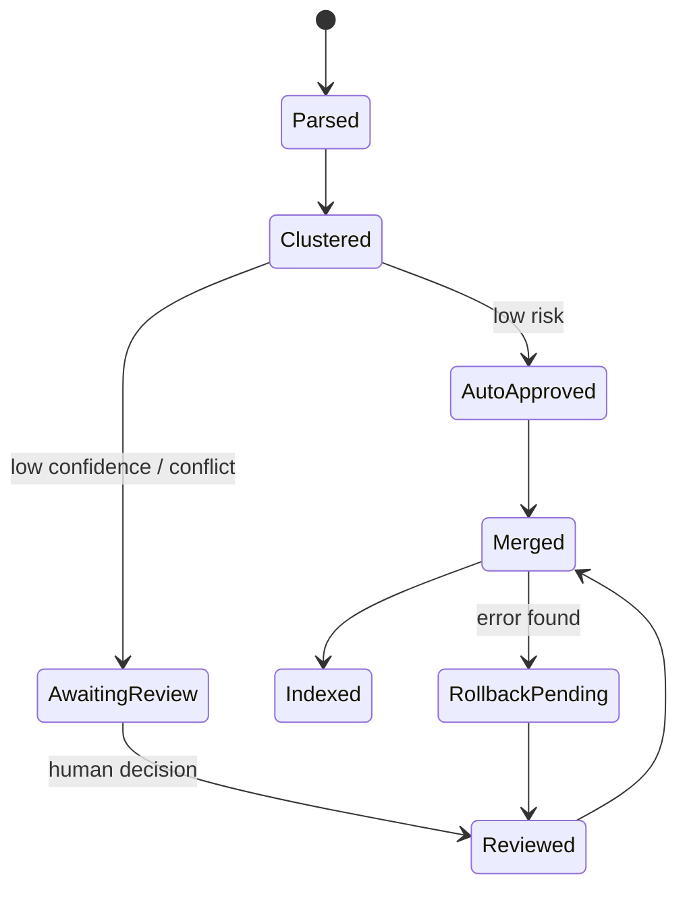

# 外部成熟项目参考：教材解析与 HITL 设计

> 核验日期：2026-05-10  
> 目的：把零散搜索沉淀成给第一顾问参考的外部项目对照，而不是直接作为实现清单。

## 结论先行

1. **P0 解析主线建议选 Docling。** 它覆盖 PDF、DOCX、XLSX、Markdown、TXT、图片等格式，能输出 Markdown / HTML / lossless JSON，并且有布局、阅读顺序、表格、公式、图片分类、OCR 等能力，最贴近本项目“多格式教材统一结构化”的验收口径。
2. **MarkItDown 不是“不行”，但不适合作为复杂医学 PDF 的唯一主引擎。** 它适合把 Office、文本型 PDF、网页、表格等快速转成 LLM 友好的 Markdown；但如果目标是稳定拿到章节、页码、图表和布局关系，需要 Docling / Marker / MinerU 这类文档理解工具承担主解析。
3. **Marker、MinerU 更适合做复杂教材解析的对照实验或兜底，不建议一开始就作为唯一方案。** Marker 强在 PDF -> Markdown / JSON、表格、公式、图片、页眉页脚去除，但 GPL-3.0 和模型权重许可要注意。MinerU 对复杂版面、公式、表格、OCR 很强，但许可证是基于 Apache 2.0 的附加条件许可，且模型依赖和部署复杂度更高。
4. **HITL、跨书图片共识、LangGraph 多 agent 是 P1/P2 或技术报告素材，不是 P0。** 当前比赛验收首先看“上传一本 PDF 后正确识别章节结构并显示前端”。不要为了展示架构感，把主线拖进多 agent + 人审系统。
5. **仓库环境要改口径。** Docling 近期版本要求 Python 3.10+；当前 README 写 Python 3.9+，如果采用 Docling，需要把项目环境统一到 Python 3.10+。

## 项目对照表

| 项目 | 最适合做什么 | 输出 | 优点 | 风险 / 边界 | 对 Hex 的建议 |
|---|---|---|---|---|---|
| [Docling](https://github.com/docling-project/docling) | 多格式文档解析主引擎 | Markdown、HTML、DocTags、lossless JSON | 多格式覆盖广；PDF 布局、阅读顺序、表格、公式、图片分类、OCR 都在一个体系内；MIT | Python 3.10+；复杂扫描件仍需实测 | **主推 P0 方案** |
| [MarkItDown](https://github.com/microsoft/markitdown) | 快速转 Markdown，面向 LLM/RAG | Markdown | MIT；Office / PDF / Excel / HTML / ZIP 等格式支持好；接入快 | 输出偏文本流，不保证复杂教材结构还原；扫描 PDF 依赖 OCR 插件或外部服务 | **作为轻量格式适配层，不做复杂 PDF 主引擎** |
| [Marker](https://github.com/datalab-to/marker) | 高质量 PDF/文档 -> Markdown / JSON | Markdown、JSON、chunks、HTML | 面向书籍和论文；保留表格、公式、图片；去页眉页脚；可输出 chunks | GPL-3.0；模型权重有商业使用条件；部署依赖重 | **复杂教材解析对照 / 兜底，不默认主线** |
| [MinerU](https://github.com/opendatalab/MinerU) | 复杂 PDF、扫描件、公式、表格、OCR | Markdown、JSON、多模态中间格式 | 支持 PDF / 图片 / DOCX / PPTX / XLSX；OCR、表格、公式、阅读顺序强；有 CLI / FastAPI / Gradio | 自定义开源许可附加条件；模型依赖复杂；本地资源压力可能高 | **高质量备选，适合做效果对照** |
| [Unstructured](https://docs.unstructured.io/open-source/core-functionality/partitioning) | 多格式 partition、表格/图片兜底 | Element 列表 | 支持 docx、pptx、xlsx、pdf、图片、txt 等；有 fast / hi_res / ocr_only 策略 | 依赖较重；hi_res 多模型依赖；复杂多栏顺序可能不稳 | **作为表格/图片/格式兜底层** |
| [pdfplumber](https://github.com/jsvine/pdfplumber) | 精细 PDF 坐标、表格调试、规则兜底 | text / csv / json | MIT；能看 char、line、rect、table；适合调章节规则和表格 debug | 不做 OCR；扫描版弱；不是高层文档理解工具 | **规则兜底和调试工具** |
| [PyMuPDF](https://pymupdf.io/) | 快速逐页文本、图片、页面渲染 | 自定义 | 速度快；逐页处理方便；适合大文件 | AGPL / 商业双许可；产品化要谨慎 | **比赛原型可用，商业叙述要避开依赖风险** |
| [OCRmyPDF](https://github.com/ocrmypdf/OCRmyPDF) | 给扫描 PDF 加 OCR 文本层 | 可搜索 PDF/PDF-A | 大文件、批处理、Tesseract 多语言、MPL-2.0 | 只是预处理，不负责章节结构 | **扫描 PDF 前置处理** |
| [PaddleOCR](https://github.com/PaddlePaddle/PaddleOCR) | 中文 OCR、版面/表格结构识别 | OCR 结果、结构化结果 | Apache-2.0；中文生态成熟；PP-Structure 可做布局和表格 | 接入成本高于 OCRmyPDF；需要模型和推理资源 | **中文扫描件增强方案** |

## 推荐落地流水线

### P0：先保证验收

```text
文件上传
  -> 文件类型识别 / hash / 原文件存储
  -> 文本层探测：抽样若干页判断是否可复制文本
  -> 如果扫描版：OCRmyPDF 或 PaddleOCR 预处理
  -> Docling 主解析
  -> 统一映射为 textbook_id / chapters[]
  -> 保存 parsed JSON
  -> 前端显示章节树和解析状态
```

P0 不要一开始做完整图片理解。对图表区域的最低可接受策略是：

- 正文中保留图表占位符。
- 保留图题、表题、页码、所在章节。
- 在 `assets[]` 里存图片 / 表格引用，后续知识图谱或 RAG 再决定是否用。

### 统一数据结构建议

当前赛题给出的结构只包含 `chapters[]`，但医学教材里图表很重要，建议在不破坏验收结构的前提下扩展：

```json
{
  "textbook_id": "book_01",
  "filename": "生理学.pdf",
  "title": "生理学",
  "total_pages": 520,
  "total_chars": 385000,
  "chapters": [
    {
      "chapter_id": "ch_01",
      "title": "第一章 绪论",
      "page_start": 1,
      "page_end": 15,
      "content": "...",
      "char_count": 8500,
      "assets": [
        {
          "asset_id": "fig_001",
          "type": "figure",
          "caption": "图1-1 细胞结构示意图",
          "page": 8,
          "path": "data/assets/book_01/fig_001.png"
        }
      ]
    }
  ],
  "parse_meta": {
    "engine": "docling",
    "fallback_engines": [],
    "ocr_required": false,
    "parse_time_sec": 0
  }
}
```

这样既满足赛题要求，又为后续图像解析、RAG 引用和报告指标留口子。

## MarkItDown 的定位

MarkItDown 可以用，但不要把它包装成“复杂医学教材解析的终局方案”。

适合：

- DOCX / XLSX / PPTX / HTML / TXT 等格式快速转 Markdown。
- 文本型 PDF 的低成本预处理。
- 快速做 RAG ingest，让 LLM 先能读。

不适合单独承担：

- 章节层级稳定识别。
- 页码、图注、表格和正文的强绑定。
- 大量扫描页、复杂多栏、图文混排医学教材。

建议口径：

> MarkItDown 作为轻量 Markdown 适配层；Docling 作为结构化主解析层；Marker / MinerU 用于复杂 PDF 质量对照。

## 章节识别策略

第一优先级：使用解析引擎输出的标题层级。

第二优先级：基于页内布局特征：

- 字号明显大于正文。
- 加粗 / 独立行 / 居中。
- 标题前后空白明显。
- 位于目录或章节首页。

第三优先级：中文医学教材正则兜底：

```text
第[一二三四五六七八九十百千0-9]+章
第[一二三四五六七八九十百千0-9]+节
^[0-9]+(\\.[0-9]+)*\\s+
绪论|总论|附录|参考文献
```

不要只靠正则。医学教材中“第 X 章”也可能出现在目录、页眉、正文引用里，必须结合页码位置、字体/块类型或目录页过滤。

## 大文件处理建议

原则：上传和解析分离，前端只看任务状态。

```text
POST /api/upload
  -> 保存文件
  -> 创建 parse_job
  -> 返回 job_id

后台解析任务
  -> queued / parsing / completed / failed
  -> 每章或每页增量写入

GET /api/textbooks/{id}/parse-status
  -> 返回当前状态、进度、错误信息
```

状态字段建议：

```json
{
  "job_id": "parse_001",
  "textbook_id": "book_01",
  "status": "parsing",
  "progress": 0.42,
  "current_page": 218,
  "total_pages": 520,
  "message": "正在识别章节结构"
}
```

## 前端上传参考

如果使用 React：

- 快速落地：优先 [Ant Design Upload](https://ant.design/components/upload/)。它天然有文件名、大小、上传进度、`uploading / done / error` 状态，适合比赛原型。
- 自定义交互：用 [react-dropzone](https://github.com/react-dropzone/react-dropzone)。它只负责拖拽和文件选择，不负责 HTTP 上传和文件列表状态，需要自己管理状态。

本项目更建议 Ant Design Upload，因为当前目标是验收，不是设计一个完全自定义上传组件。

## 医学教材图片解析：建议放到 P1/P2

你搜索里的 HITL、跨书图片共识、批处理、多 agent 工作流是有价值的，但要放对位置。

P0 只需要：

- 图表区域不污染正文。
- 图注、表注、页码能保留。
- RAG 引用不要编造图表来源。

P1/P2 才考虑：

- 图像分类：解剖图、病理图、流程图、显微图、表格、公式。
- 图注对齐：图片和 caption 是否配对正确。
- 图中文字 OCR：结构名、箭头标注、病灶名称。
- 跨书图片共识：同一结构在不同教材中的别名归一。
- HITL：只让人审高冲突、低置信度、关键医学图。

## HITL 共识机制参考

如果要写进技术报告，可以采用这个机制：

```text
自动预标
  -> 跨书聚类
  -> 冲突检测
  -> 人工批量审核
  -> 共识写回
  -> 后续批次继承 / 回滚
```

冲突类型：

- `synonym`：同义术语，例如“左心室 / 左室 / left ventricle”。
- `condition_difference`：条件差异，例如基础医学视角和临床视角不同。
- `source_error`：图注错配、页码错、OCR 错。
- `version_update`：新版术语替代旧版术语。

推荐数据结构：

```json
{
  "cluster_id": "img_cluster_1024",
  "canonical_entity": "left_ventricle",
  "canonical_label": "左心室",
  "aliases": ["左室", "left ventricle"],
  "sources": [
    {
      "book": "局部解剖学",
      "page": 32,
      "figure_id": "fig_003",
      "label": "左心室",
      "confidence": 0.93
    }
  ],
  "consensus": {
    "decision": "merge",
    "conflict_type": "synonym",
    "confidence": 0.96
  },
  "human_review": {
    "required": true,
    "status": "approved",
    "reason": "同一解剖结构，不同术语"
  }
}
```

## HITL 量化指标

技术报告中不要只写“提升准确率”，要拆成可测指标：

| 指标 | 含义 | 用途 |
|---|---|---|
| 章节识别准确率 | 识别出的章节标题与人工标注一致比例 | P0 核心 |
| 图注对齐准确率 | 图片与 caption 配对正确比例 | 医学图质量 |
| OCR 字符错误率 | OCR 文本与人工文本差异 | 扫描教材质量 |
| 结构/器官标注 F1 | 图内实体检测或标注的 Precision / Recall 综合 | 图片知识质量 |
| 低置信度召回率 | 真正有问题的样本被送审比例 | HITL 路由 |
| 人工介入率 | 需要人审的样本占比 | 效率 |
| 单簇平均审核时间 | 审一个跨书图片簇的平均耗时 | 批处理效率 |
| 冲突拦截率 | 发布前拦住真实冲突的比例 | 安全性 |
| 来源保留率 | 共识结果能追溯到原始来源的比例 | 可审计性 |

对本比赛最有用的三个指标：

1. 章节识别准确率。
2. 图注对齐准确率。
3. RAG 引用来源准确率。

## LangGraph 的参考价值

[LangGraph interrupts](https://docs.langchain.com/oss/python/langgraph/interrupts) 和 [persistence](https://docs.langchain.com/oss/python/langgraph/persistence) 可以支撑 human-in-the-loop：流程在关键节点暂停，保存状态，等待人工输入后恢复。

但对当前项目，LangGraph 更适合作为“架构说明和未来扩展”材料，而不是 P0 必选依赖。

如果第一顾问坚持写 multi-agent + HITL，可以这样收束：



注意口径：

- HITL 是“高风险样本路由”，不是所有样本都人工审核。
- 审核粒度是“簇”，不是单图。
- 人工结果必须写回 provenance，支持回滚。
- P0 可以只做 review queue 的数据结构，不必做完整人审界面。

## 解析工具小基准实验

给第一顾问的最小实验，不要泛泛比较。

从 7 本教材中各抽 3 类页面：

1. 目录页或章节首页。
2. 密集正文页。
3. 含图表/公式/显微图的复杂页。

对 Docling、MarkItDown、Marker、MinerU 跑同一批样本，记录：

| 指标 | 说明 |
|---|---|
| chapter_title_hit | 章节标题是否识别正确 |
| page_mapping_ok | 内容是否能追溯到原页码 |
| text_coverage | 抽取文本覆盖率 |
| header_footer_noise | 页眉页脚污染程度 |
| figure_caption_ok | 图和图注是否绑定 |
| table_quality | 表格是否还能读 |
| parse_time | 单页 / 单书耗时 |
| install_cost | 安装和模型下载成本 |
| license_risk | MIT / Apache / GPL / 自定义许可 |

结论不需要追求绝对客观，只要能回答一个问题：

> 哪个工具最适合 5 小时内把“上传 PDF -> 识别章节 -> 前端展示”跑通？

按当前核验，默认答案是 Docling。

## 给第一顾问的建议口径

可以直接转述：

> 解析层不要从 PyPDF2 / PyMuPDF 手写起步。先用 Docling 打主线，统一输出为项目定义的 `textbook_id / chapters[]`。MarkItDown 作为 Office 和文本型文档的快速 Markdown 适配层；Marker / MinerU 作为复杂 PDF 的效果对照，不默认放进 P0。HITL 和跨书图片共识只写成 P1/P2 设计和技术报告亮点，当前先保证 PDF 章节识别、页码追溯、解析状态展示能跑通。

## 需要同步修改的项目文档

如果采用本文建议，后续需要改：

1. `README.md`：Python 版本从 `3.9+` 改为 `3.10+`。
2. `requirements.txt`：新增 `docling`；如果保留 `read_pdf.py`，补 `PyPDF2`，否则删除或标注为一次性脚本。
3. `docs/系统设计.md`：解析层从“PyMuPDF 主解析”改成“Docling 主解析 + pdfplumber/PyMuPDF 规则兜底”。
4. `docs/Agent架构说明.md`：HITL / LangGraph 只作为扩展设计，不要和当前单 Agent P0 主线冲突。

## 参考源

- [Docling GitHub](https://github.com/docling-project/docling)
- [Docling CLI reference](https://docling-project.github.io/docling/reference/cli/)
- [MarkItDown GitHub](https://github.com/microsoft/markitdown)
- [Marker GitHub](https://github.com/datalab-to/marker)
- [MinerU GitHub](https://github.com/opendatalab/MinerU)
- [MinerU Docs](https://opendatalab.github.io/MinerU/)
- [Unstructured partitioning docs](https://docs.unstructured.io/open-source/core-functionality/partitioning)
- [pdfplumber GitHub](https://github.com/jsvine/pdfplumber)
- [PyMuPDF license overview](https://pymupdf.io/)
- [OCRmyPDF GitHub](https://github.com/ocrmypdf/OCRmyPDF)
- [PaddleOCR GitHub](https://github.com/PaddlePaddle/PaddleOCR)
- [LangGraph interrupts](https://docs.langchain.com/oss/python/langgraph/interrupts)
- [LangGraph persistence](https://docs.langchain.com/oss/python/langgraph/persistence)
- [Ant Design Upload](https://ant.design/components/upload/)
- [react-dropzone GitHub](https://github.com/react-dropzone/react-dropzone)
