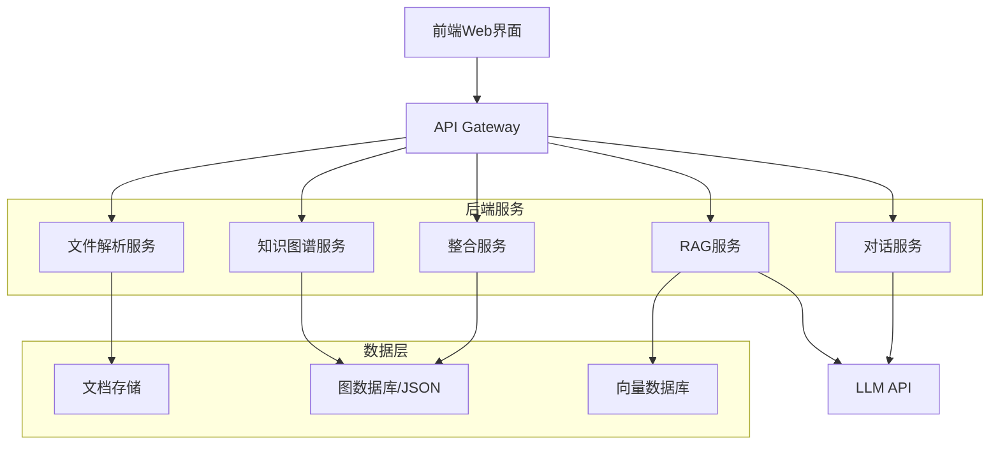
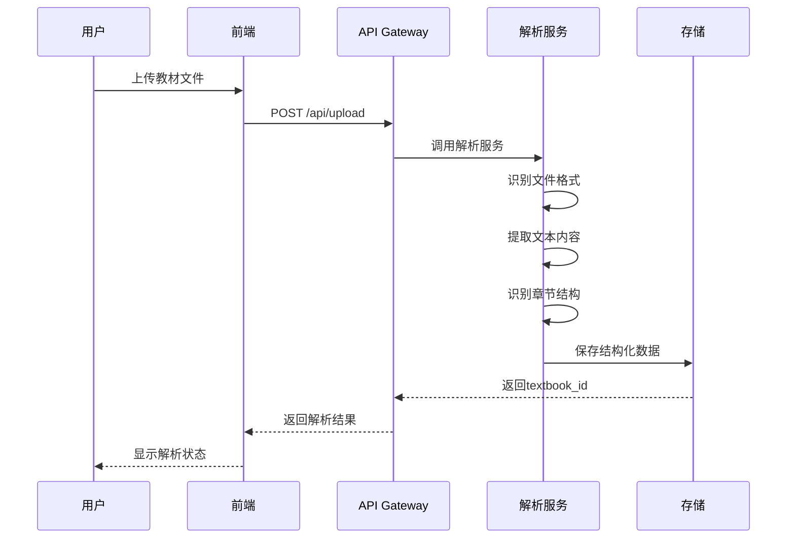
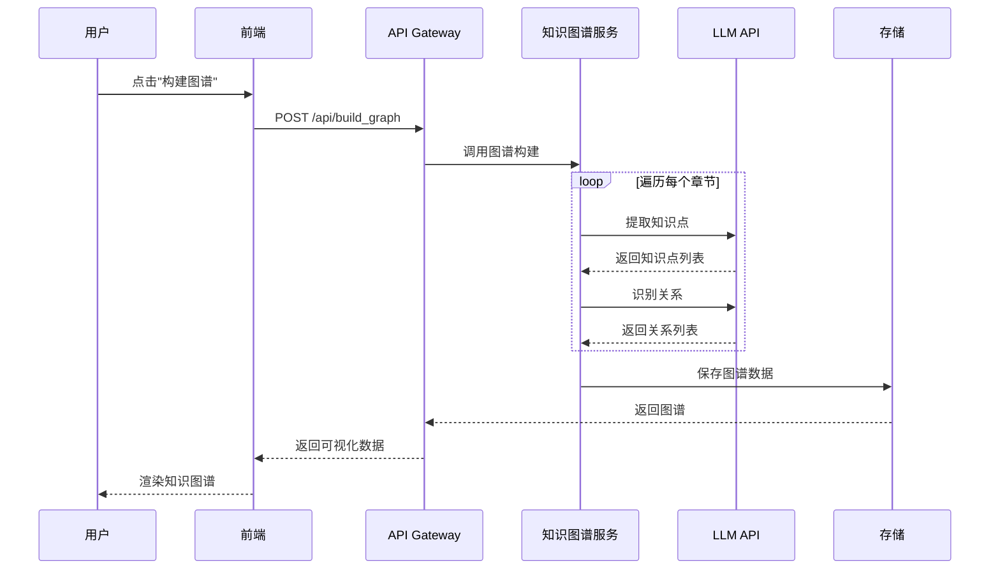
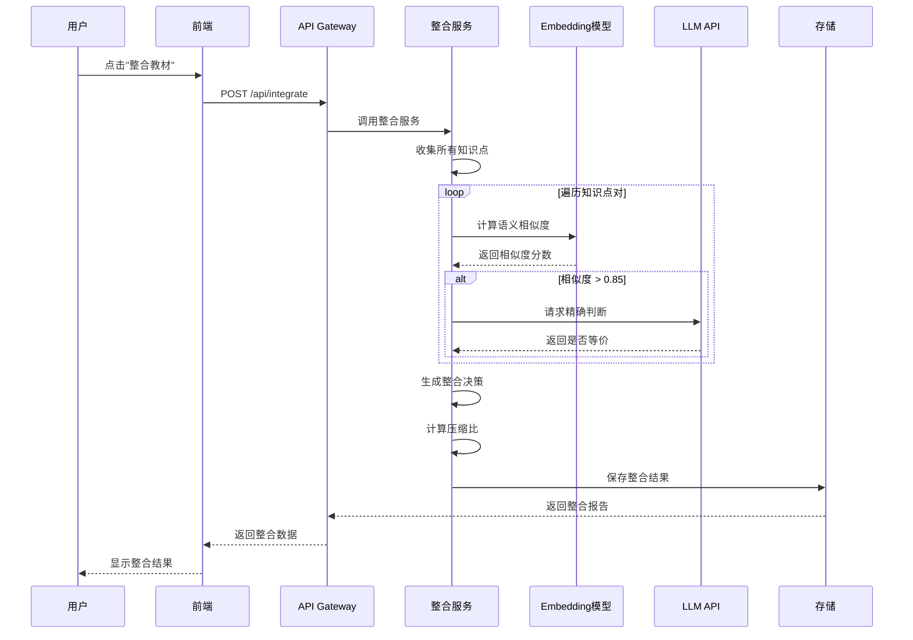
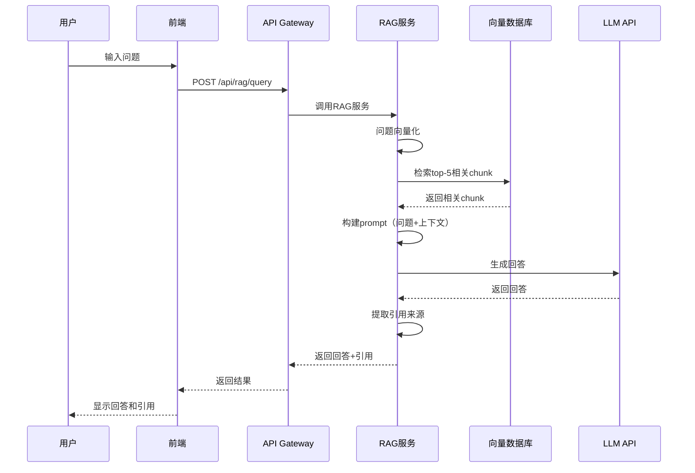

# 系统设计

## 1. 系统架构总览

### 1.1 架构图



### 1.2 技术选型

| 层级 | 技术选型 | 理由 |
|------|---------|------|
| 前端框架 | React + TypeScript | 组件化开发，类型安全 |
| 后端框架 | FastAPI | 异步支持，自动API文档，性能优秀 |
| 知识图谱可视化 | D3.js / ECharts | D3灵活度高，ECharts开箱即用 |
| 文档解析 | PyMuPDF | 速度快，支持章节识别 |
| 文本嵌入 | sentence-transformers | 本地运行，免费，支持中文 |
| 向量检索 | FAISS | 轻量级，速度快，适合中小规模数据 |
| LLM API | 通义千问/DeepSeek | 国内API，成本低，速度快 |
| 数据存储 | SQLite + JSON文件 | 轻量级，无需额外部署 |

## 2. 数据流设计

### 2.1 教材上传与解析流程



**数据结构**：
```json
{
  "textbook_id": "book_01",
  "filename": "生理学.pdf",
  "title": "生理学",
  "total_pages": 520,
  "total_chars": 385000,
  "chapters": [
    {
      "chapter_id": "ch_01",
      "title": "第一章 绪论",
      "page_start": 1,
      "page_end": 15,
      "content": "...",
      "char_count": 8500
    }
  ]
}
```

### 2.2 知识图谱构建流程



**LLM Prompt设计**：

**提取知识点**：
```
你是一个医学教材知识点提取专家。请从以下章节中提取核心知识点。

章节内容：
{chapter_content}

要求：
1. 提取核心概念、定理、方法、现象
2. 每个知识点包含：名称、定义、类别
3. 输出JSON格式

输出格式：
{
  "knowledge_points": [
    {
      "name": "动作电位",
      "definition": "细胞受到刺激后，膜电位发生的一次快速而可逆的倒转",
      "category": "核心概念"
    }
  ]
}

示例：
输入："炎症是机体对致炎因子的损伤所发生的防御性反应..."
输出：{"knowledge_points": [{"name": "炎症", "definition": "机体对致炎因子的损伤所发生的防御性反应", "category": "核心概念"}]}
```

**识别关系**：
```
你是一个知识关系识别专家。请识别以下知识点之间的关系。

知识点列表：
{knowledge_points}

关系类型：
- prerequisite: A是B的前置依赖（学习B之前必须先掌握A）
- parallel: A和B是并列关系（同一层级的平行概念）
- contains: A包含B（上位概念与下位概念）
- applies_to: A应用于B（某知识点是另一个的应用场景）

输出JSON格式：
{
  "relations": [
    {
      "source": "静息电位",
      "target": "动作电位",
      "type": "prerequisite",
      "description": "理解动作电位需要先掌握静息电位的概念"
    }
  ]
}
```

### 2.3 跨教材整合流程



**整合决策数据结构**：
```json
{
  "decision_id": "merge_001",
  "action": "merge",
  "affected_nodes": ["book01_node_015", "book03_node_032", "book05_node_008"],
  "result_node": "merged_node_001",
  "reason": "三本教材都讲解了'炎症'的概念，保留《病理学》的版本因其描述最系统完整",
  "confidence": 0.92,
  "original_chars": 2400,
  "merged_chars": 850
}
```

### 2.4 RAG问答流程



**RAG Prompt设计**：
```
你是一个医学知识问答助手。请基于以下上下文回答用户问题。

上下文：
{context_chunks}

用户问题：
{question}

要求：
1. 只基于提供的上下文回答，不使用自身知识
2. 每个回答附带来源引用，格式为[教材名称,第X章,第X页]
3. 如果上下文中找不到答案，回复"当前知识库中未找到相关信息"

输出格式：
{
  "answer": "回答内容",
  "citations": [
    {"textbook": "病理学", "chapter": "第四章 炎症", "page": 78}
  ]
}
```

## 3. API接口设计

### 3.1 教材管理

**上传教材**
```
POST /api/upload
Content-Type: multipart/form-data

Request:
- file: 教材文件

Response:
{
  "textbook_id": "book_01",
  "filename": "生理学.pdf",
  "status": "uploaded"
}
```

**解析教材**
```
POST /api/parse
Content-Type: application/json

Request:
{
  "textbook_id": "book_01"
}

Response:
{
  "textbook_id": "book_01",
  "title": "生理学",
  "total_pages": 520,
  "total_chars": 385000,
  "chapters": [...]
}
```

### 3.2 知识图谱

**构建图谱**
```
POST /api/build_graph
Content-Type: application/json

Request:
{
  "textbook_id": "book_01"
}

Response:
{
  "graph_id": "graph_01",
  "nodes": [...],
  "edges": [...],
  "stats": {
    "node_count": 150,
    "edge_count": 320
  }
}
```

**获取图谱**
```
GET /api/graph/{graph_id}

Response:
{
  "nodes": [
    {
      "id": "node_001",
      "name": "动作电位",
      "definition": "...",
      "category": "核心概念",
      "chapter": "第二章",
      "page": 35
    }
  ],
  "edges": [
    {
      "source": "node_001",
      "target": "node_002",
      "type": "prerequisite"
    }
  ]
}
```

### 3.3 整合服务

**执行整合**
```
POST /api/integrate
Content-Type: application/json

Request:
{
  "textbook_ids": ["book_01", "book_02", "book_03"]
}

Response:
{
  "integration_id": "int_001",
  "decisions": [...],
  "compression_ratio": 0.28,
  "original_chars": 1200000,
  "merged_chars": 336000
}
```

### 3.4 RAG服务

**建立索引**
```
POST /api/rag/index
Content-Type: application/json

Request:
{
  "textbook_ids": ["book_01", "book_02"]
}

Response:
{
  "status": "indexed",
  "chunk_count": 2500
}
```

**问答查询**
```
POST /api/rag/query
Content-Type: application/json

Request:
{
  "question": "什么是炎症？"
}

Response:
{
  "answer": "炎症是机体对致炎因子的损伤所发生的防御性反应...",
  "citations": [
    {
      "textbook": "病理学",
      "chapter": "第四章 炎症",
      "page": 78,
      "relevance_score": 0.92
    }
  ],
  "source_chunks": ["..."]
}
```

### 3.5 对话服务

**发送消息**
```
POST /api/chat
Content-Type: application/json

Request:
{
  "session_id": "sess_001",
  "message": "为什么把《生理学》里的'炎症'和《病理学》里的'炎症反应'合并了？"
}

Response:
{
  "reply": "这两个知识点经过语义对齐分析，相似度达到0.94...",
  "updated_decisions": [...]
}
```

## 4. 数据库设计

### 4.1 文件存储结构

```
data/
├── textbooks/              # 原始教材文件
│   ├── book_01.pdf
│   └── book_02.pdf
├── parsed/                 # 解析后的结构化数据
│   ├── book_01.json
│   └── book_02.json
├── graphs/                 # 知识图谱数据
│   ├── graph_01.json
│   └── graph_02.json
├── integrations/           # 整合结果
│   └── int_001.json
└── vector_db/              # 向量数据库
    ├── index.faiss
    └── metadata.json
```

### 4.2 SQLite数据库（可选）

**表结构**：

```sql
-- 教材表
CREATE TABLE textbooks (
    id TEXT PRIMARY KEY,
    filename TEXT,
    title TEXT,
    total_pages INTEGER,
    total_chars INTEGER,
    upload_time TIMESTAMP
);

-- 知识点表
CREATE TABLE knowledge_points (
    id TEXT PRIMARY KEY,
    textbook_id TEXT,
    name TEXT,
    definition TEXT,
    category TEXT,
    chapter TEXT,
    page INTEGER,
    FOREIGN KEY (textbook_id) REFERENCES textbooks(id)
);

-- 关系表
CREATE TABLE relations (
    id INTEGER PRIMARY KEY AUTOINCREMENT,
    source_id TEXT,
    target_id TEXT,
    relation_type TEXT,
    description TEXT,
    FOREIGN KEY (source_id) REFERENCES knowledge_points(id),
    FOREIGN KEY (target_id) REFERENCES knowledge_points(id)
);
```

## 5. 前端设计

### 5.1 页面布局

```
+----------------------------------------------------------+
|  顶部导航栏                                                |
+----------------------------------------------------------+
|          |                                    |           |
|  左侧    |        中间知识图谱可视化区           |   右侧    |
|  教材    |                                    |   功能    |
|  管理    |                                    |   面板    |
|  区      |                                    |           |
|          |                                    |   Tab1    |
|  - 上传  |                                    |   整合    |
|  - 列表  |                                    |           |
|  - 状态  |                                    |   Tab2    |
|          |                                    |   RAG     |
|          |                                    |   问答    |
|          |                                    |           |
|          |                                    |   Tab3    |
|          |                                    |   对话    |
+----------------------------------------------------------+
|  底部状态栏（压缩比、节点数等统计信息）                      |
+----------------------------------------------------------+
```

### 5.2 组件设计

**核心组件**：
- `TextbookUploader`: 教材上传组件
- `TextbookList`: 教材列表组件
- `KnowledgeGraph`: 知识图谱可视化组件
- `IntegrationPanel`: 整合操作面板
- `RAGChat`: RAG问答组件
- `DialoguePanel`: 多轮对话组件
- `ReportViewer`: 整合报告查看器

## 6. 性能优化

### 6.1 解析优化
- 大文件逐页解析，避免内存溢出
- 使用异步处理，提升并发能力

### 6.2 图谱渲染优化
- 节点数>500时，使用虚拟化渲染
- 支持按章节/教材筛选显示

### 6.3 向量检索优化
- 使用FAISS的IVF索引（倒排索引）
- 预计算常见问题的向量

### 6.4 缓存策略
- LLM响应缓存（相同输入返回缓存结果）
- 图谱数据缓存（避免重复计算）

## 7. 部署方案

### 7.1 本地开发
```bash
# 后端
uvicorn src.backend.main:app --reload --port 8000

# 前端
cd src/frontend && npm run dev
```

### 7.2 Docker部署
```yaml
version: '3.8'
services:
  backend:
    build: ./src/backend
    ports:
      - "8000:8000"
    volumes:
      - ./data:/app/data
  
  frontend:
    build: ./src/frontend
    ports:
      - "3000:3000"
    depends_on:
      - backend
```

### 7.3 魔搭创空间部署
- 使用Gradio/Streamlit构建界面
- 后端API集成到同一应用中
- 配置requirements.txt和app.py

## 8. 测试策略

### 8.1 单元测试
- 文档解析测试
- 知识点提取测试
- 语义对齐测试

### 8.2 集成测试
- 完整流程测试（上传→解析→构建→整合→问答）

### 8.3 RAG Benchmark
- 自建20-50个测试问题
- 评估准确率、引用准确率、响应时间
